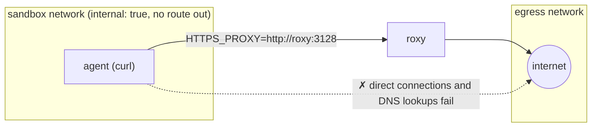
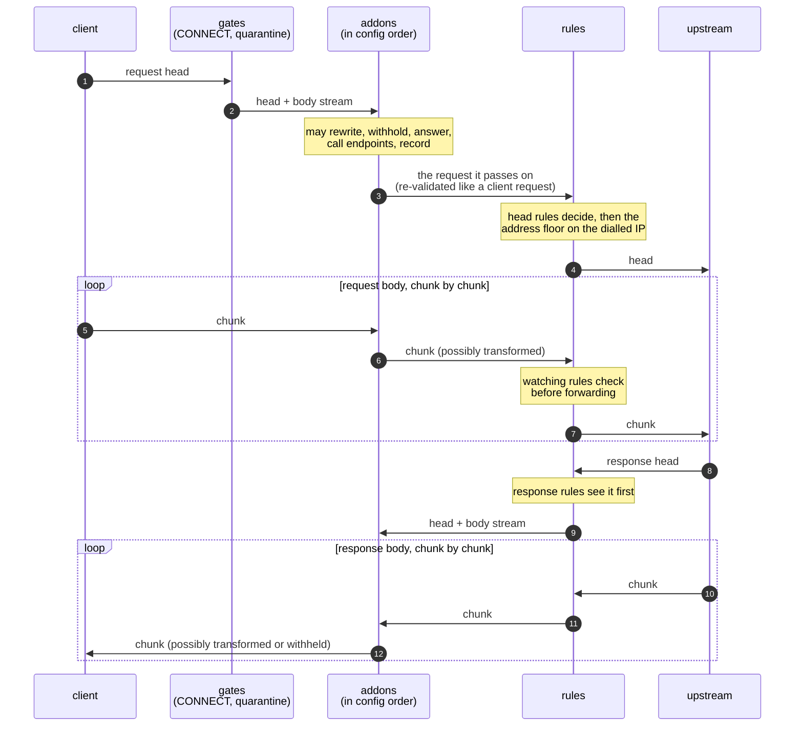

# roxy

roxy is a strict, programmable HTTP firewall and egress proxy. Clients use
it as an explicit `HTTP_PROXY`. It terminates TLS with leaf certificates
minted by its own CA, parses every request into a strict canonical model,
and re-serialises it in one unambiguous wire form, so smuggling and
header-injection tricks never reach the upstream. Every exchange then runs
through a pipeline you control:

- **Rules:** a YAML policy with a small, statically typed rule language.
  Deny always wins, there is an explicit default, and rules can keep
  watching an exchange as its bodies stream. Stateful metrics give rate and
  byte budgets, address lists give deny lists, and secret injection means
  clients only ever hold placeholders.
- **Addons:** plugin layers above the rules that own both streams: WASM
  components run in-process, or external services the traffic streams
  through. They can rewrite, withhold, score, answer or block traffic,
  call out to other services, and keep state. Whatever they let through is
  still judged by the rules.
- **Audit:** a structured JSONL flow log with the rule or addon behind
  every decision, and optional capture of traffic to disk.

It fails closed. Anything it cannot parse, verify or classify is dropped,
the default denies anything no rule allows, and a failing input or addon
denies rather than allows. That makes it a good fit wherever outbound HTTP
needs a hard boundary: untrusted or semi-trusted workloads such as AI
agents, CI jobs, sandboxes and third-party code; an egress gateway for a
fleet; or a place to plug in inspection, redaction and policy without
touching the clients. See [DESIGN.md](DESIGN.md) for the design, threat
model and roadmap.

## Quickstart

[`examples/compose`](examples/compose) runs a client container (curl, the
`agent` service) whose only way to the internet is through roxy:



```sh
cd examples/compose
docker compose up -d --wait     # ghcr.io/roxy-proxy/roxy:edge; add --build to build this checkout
./demo.sh                       # what the client can and cannot do
docker compose logs roxy        # roxy's flow log: one JSON line per decision
docker compose down -v
```

`demo.sh` runs these from inside the client:

| from the client | result |
|---|---|
| `curl https://example.com/` | `200`: rule `example-reads` allows it |
| `curl https://www.wikipedia.org/` | `403` from roxy: no rule allows it (`_default`) |
| `curl https://example.com/admin/` | `403` from roxy: rule `no-admin-paths` denies it, whatever allows the host |
| a 2 MB `POST` to `postman-echo.com` | `413`: the watching rule `upload-cap` stops it mid-upload |
| `curl --noproxy '*' https://example.com/` | fails: the name does not even resolve |
| `curl --noproxy '*' https://1.1.1.1/` | fails: no route |

**Containment comes from the network, not from the proxy settings.** roxy
is an explicit proxy, not a transparent gateway. The client's
`HTTPS_PROXY` only tells well-behaved clients where roxy is. What contains
the client is that it sits only on an `internal: true` Docker network, which
has no route out and no outside DNS, and that roxy is the only container on
both that network and one with a route out. A client that ignores the proxy
variables, or a library that opens its own sockets, gets nowhere.

To contain something real, replace the `agent` service with your workload
(keeping `networks: [sandbox]` and its environment) and edit
[`roxy.yaml`](examples/compose/roxy.yaml). After editing the policy,
`docker compose kill -s HUP roxy` reloads it: a bad policy is rejected and
the running one stays (see `docker compose logs roxy`). Restart instead
(`docker compose restart roxy`) for listener, TLS or capture settings.

## Why an explicit HTTP proxy

roxy is deliberately an explicit `HTTP_PROXY`, not a transparent TCP
gateway. That is a defensive choice: the interface it exposes to clients
is as narrow as it can be while still being useful.

- **One protocol, parsed strictly.** A client can speak HTTP/1.1 or HTTP/2
  to roxy, and nothing else. `CONNECT` only opens a tunnel that roxy
  intercepts as TLS (or, if allowed, plain HTTP). Raw TCP never passes
  through. A TCP gateway forwards every protocol, so it either relays bytes
  it cannot judge or has to understand all of them.
- **Destinations are names, not addresses.** Each request names its
  destination in a form roxy parses itself: the absolute URI, the
  `CONNECT` authority, and an SNI that must match it. The rules judge that
  name. roxy resolves it, and then checks the private-range floor and the
  deny lists against the IP it actually dials. There is no
  original-destination address to spoof or race.
- **Nothing is implicit.** A client that bypasses the proxy should reach
  nothing. Every other egress path is closed by the network
  ([see below](#containing-a-workload)); roxy does not rely on the client
  choosing to use the proxy. Everything that does reach roxy is decided
  by a rule, and anything it cannot classify is dropped.

The narrower the interface, the fewer ways an adversarial client has to
make roxy misread what it is sending. Transparent mode is designed
(DESIGN.md §4.2), but it is deferred and will feed the same pipeline.

## Extending roxy

roxy itself knows HTTP, not any particular application or API. Logic that
needs to understand the traffic goes in an **addon**: a plugin layer that
sits above the rules in every exchange and owns both streams. An addon can:

- read, rewrite, withhold or replace request and response bodies, chunk by
  chunk as they stream;
- deny, or answer directly;
- call named endpoints (a classifier, a model, an internal API) with
  credentials roxy attaches and the addon never sees;
- keep per-principal state, record structured audit events, and
  quarantine a client.

Addons stack in the order configured, and run in one of two modes:
`enforce` (in the path) or `observe` (gets a copy, cannot affect traffic).
The first addon sees each request first and each response last; the rules
sit below every addon, next to the network:



Nothing is buffered unless a rule or an addon asks to read a body, and then
only up to its cap. An addon that fails denies the flow, or cuts the body
if the response has started.

Addons cannot weaken the boundary. Whatever an addon sends on is
re-validated and judged by the rules as if the client had sent it. Every
addon runs under CPU, memory and time budgets, and any failure denies the
flow (DESIGN.md §11).

- **WASM components** run in-process and sandboxed, with no filesystem,
  sockets or environment. Write them in Rust with the
  [`roxy-addon`](crates/roxy-addon) SDK, or in any language that targets
  the WebAssembly component model, against [`wit/addon.wit`](wit/addon.wit).
- **Service layers** stream the exchange through an external HTTP service,
  for logic in any language that is easier to run out of process (DESIGN.md
  §11.6).

For example, [inspect_sentinel](https://github.com/meridianlabs-ai/inspect_sentinel)
monitors and control protocols can run at the boundary to supervise AI
agents, where the agent cannot bypass them. That comes as a Python sidecar
on a service layer first, and as a compiled component once inspect_sentinel
supports one. See [`examples/addons`](examples/addons).

## Containing a workload

The same recipe applies outside Docker Compose:

1. **Take away the workload's route out.** Put it in a network namespace,
   VM or container network whose only reachable host is roxy: block
   everything else, including direct TCP, UDP and DNS, at the network layer.
   roxy resolves DNS itself, so the workload needs none.
2. **Give roxy a route out**, and the workload a route to roxy's proxy port
   (3128 in the examples). Keep the CA endpoint (3130) reachable from the
   workload only if it should fetch the CA itself.
3. **Point the workload at roxy and make it trust roxy's CA.** Get the CA
   certificate in one of three ways:

   ```sh
   roxy ca export --config roxy.yaml > roxy-ca.pem                            # at image build time
   curl -s http://<ca_server.bind>/roxy-ca.pem > roxy-ca.pem                  # from the CA server
   curl -s -x http://<proxy> http://roxy.internal/roxy-ca.pem > roxy-ca.pem   # through the proxy
   ```

   Then, in the workload's environment:

   ```sh
   export HTTP_PROXY=http://<proxy> HTTPS_PROXY=http://<proxy>
   export http_proxy=$HTTP_PROXY https_proxy=$HTTPS_PROXY   # curl reads only the lower-case http_proxy
   export SSL_CERT_FILE=/path/roxy-ca.pem         # OpenSSL-based tools, Python ssl, Go
   export REQUESTS_CA_BUNDLE=/path/roxy-ca.pem    # Python requests
   export NODE_EXTRA_CA_CERTS=/path/roxy-ca.pem   # Node
   export CURL_CA_BUNDLE=/path/roxy-ca.pem        # curl
   ```

   Adding the certificate to the system trust store also works. Do not put
   external hosts in `NO_PROXY`.

## Container image

`ghcr.io/roxy-proxy/roxy` is built from the `Dockerfile` for `linux/amd64`
and `linux/arm64`. Tags: `edge` (every push to `main`), and `vX.Y.Z`,
`X.Y` and `latest` for releases.

- A static musl binary on `gcr.io/distroless/static-debian12:nonroot`,
  about 15 MB unpacked. There is no shell and no package manager.
- Runs as UID/GID `65532` and works with a read-only root filesystem.
- Upstream TLS trusts the embedded Mozilla roots (`webpki-roots`) plus
  `tls.upstream.extra_roots`, so the image ships no CA bundle.
- Published images carry an SBOM and SLSA provenance and are signed with
  cosign (keyless). Every build is scanned with Trivy.

Run it with the hardening flags:

```sh
docker run -d --name roxy \
  --read-only --cap-drop=ALL --security-opt=no-new-privileges \
  -v roxy-ca:/var/lib/roxy/ca \
  -v ./roxy.yaml:/etc/roxy/roxy.yaml:ro \
  -p 3128:3128 -p 3130:3130 \
  ghcr.io/roxy-proxy/roxy:edge
```

| path | what |
|---|---|
| `/etc/roxy/roxy.yaml` | config; the default is [`examples/docker/roxy.yaml`](examples/docker/roxy.yaml). Mount your own read-only. |
| `/var/lib/roxy/ca` | volume: the CA key and certificate, generated on first start. **Keep it**: a new CA means every client must re-trust it. Owned by 65532, mode 0700. |
| `/var/log/roxy` | volume, for a config that sets `log.flow.path` (for example `/var/log/roxy/flow.jsonl`). The default config logs flows to stdout (`docker logs`). |
| `capture_dir` | traffic capture (§10.2) is off by default. If you set `capture_dir`, mount a volume there (for example `-v roxy-capture:/var/lib/roxy/capture`); the root filesystem is read-only. |

Ports: `3128` is the proxy listener and `3130` is `ca_server`
(`/roxy-ca.pem`, `/healthz`). Keep `3130` off networks the workload should not
reach if you do not want it to fetch the CA itself.

The image's `HEALTHCHECK` runs `roxy health`, a small built-in HTTP probe
(there is no curl), against `http://127.0.0.1:3130/healthz`. A config that
moves or removes `ca_server` needs `--health-cmd` or `--no-healthcheck`.
Other subcommands run the same way:

```sh
docker run --rm -v ./roxy.yaml:/etc/roxy/roxy.yaml:ro ghcr.io/roxy-proxy/roxy:edge \
  check --config /etc/roxy/roxy.yaml
docker run --rm -v roxy-ca:/var/lib/roxy/ca ghcr.io/roxy-proxy/roxy:edge \
  ca export --config /etc/roxy/roxy.yaml > roxy-ca.pem
```

Verify a published image's signature:

```sh
cosign verify ghcr.io/roxy-proxy/roxy:edge \
  --certificate-identity-regexp '^https://github.com/roxy-proxy/roxy-proxy/\.github/workflows/image\.yml@' \
  --certificate-oidc-issuer https://token.actions.githubusercontent.com
```

## Writing rules

A policy is a list of allows plus denies that restrict them. Precedence, from
highest:

1. **Any matching `deny`.** A deny always wins, wherever it sits in the list.
2. **Any matching `allow`.**
3. **The default**: `default: deny` (the default) or `default: allow`.

Rule order does not change the decision. It only orders effects, such as
header changes, and makes tags set by one rule visible to the rules below it.

**When a rule runs** follows from what it reads. Most rules read the request
head (host, method, path, headers, metrics) and are decided before anything
is forwarded. A rule that reads something that only arrives later, such as
`body.bytes` as an upload streams, `response.status`, or the response body,
keeps watching the exchange and stops it the moment it matches. Watching
rules can only deny, since the request is already on its way. `roxy check`
says which kind each rule is.

```yaml
default: deny

metrics:
  - id: github_writes
    count: requests
    where: host under "api.github.com" and method in [POST, PUT, PATCH, DELETE]
    key: [client.ip]
    window: 1m

address_lists:
  - name: blocked
    file: /etc/roxy/lists/blocked.txt     # one CIDR per line, `#` comments

upstream:
  deny_lists: [blocked]                   # hard floor on every connect

rules:
  - id: github-reads
    when: host under "github.com" and method in [GET, HEAD]
    then: allow

  - id: openai
    when: host == "api.openai.com" and path starts_with "/v1/" and method == POST
    then:
      - set_header: { authorization: "Bearer ${secret:openai}" }   # the client never sees the key
      - allow

  - id: no-writes-burst                    # restricts the allows above
    when: metric.github_writes >= 30
    then: { deny: { status: 429 } }

  - id: upload-cap                         # watches the body as it streams
    when: host == "api.openai.com" and body.bytes > 10mb
    then: { deny: { status: 413 } }
```

**Missing values are `null`.** An unsent header, `client.user` without proxy
auth, and `body.size` for a chunked body are all `null`. `==`, `!=`, `in` and
`not in` treat `null` as an ordinary value. Any other operator on `null`
denies the request and names the field. Guard with `x != null and ...` when a
value may be absent:

```yaml
when: body.size != null and body.size > 10mb
```

Try a rule without sending traffic:

```sh
roxy rule test --config roxy.yaml GET https://api.github.com/repos/a/b
roxy rule test --config roxy.yaml --metric github_writes=30 POST https://api.github.com/repos/a/b/issues
```

The dry run exits 0 on allow and 3 on deny. It prints the matching rules, the
effects and the decision. Metrics you do not pass default to 0, and
`--metric id=unavailable` exercises the fail-closed path.

The full language is in DESIGN.md §6. That covers operators (`== in under like
matches starts_with`...), every field and when it is known, units (`10mb`,
`1m`), CIDRs, `@list` membership, and every action.

## Flow log

One JSON object per line, to stdout or `log.flow.path`. Each request has a
`request` event:

```json
{"event":"request","flow":"01M4…","client":{"ip":"10.0.0.7"},"tls":{"sni":"example.com","alpn":"http/1.1"},
 "req":{"method":"GET","host":"example.com","path":"/","body_bytes":0},"res":{"status":200,"body_bytes":577},
 "decision":"allow","rules":["example"],"terminal_rule":"example","stage":"head","timing":{"total_ms":50}}
```

Denies carry `terminal_rule` (`_default`, `_fail_closed`,
`_address_policy`, or a rule id) and a `reason` when they fail closed.
`stage` says where the decision was made: `head`, or where a watching rule
stopped the exchange (`request_body`, `response_head`, `response_body`,
`websocket`).
Secrets and sensitive headers are redacted. Other events include
`parse_error`, `upstream_error`, `upstream_denied`,
`policy_input_unavailable`, `config_reloaded`, `config_reload_failed`,
`ws_open` and `ws_close`.

The flow log is an audit trail, so roxy never drops a record. One writer
thread per destination batches writes. If the log falls behind (more than
`high_water` unwritten) or the disk fails, roxy holds traffic back until it
catches up rather than losing records. Files can rotate by size:

```yaml
log:
  flow:
    path: /var/log/roxy/flow.jsonl
    high_water: 8mb          # unwritten log at which traffic is held (default 8mb)
    max_file_bytes: 100mb    # rotate to flow.jsonl.<UTC timestamp>-<seq>
    max_files: 10            # keep the newest 10 rotated files
    compress: true           # gzip rotated files
```

`SIGHUP` also reopens the file, for external `logrotate`.

### Capturing traffic

roxy can tee the heads and bodies of exchanges to `<capture_dir>/capture.rxc`
exactly as forwarded. It captures exchanges a rule selects with
`capture: request | response | both`, or all traffic with
`log.capture.all: true`. Capture uses the same writer as the flow log: it
rotates, and it holds traffic back rather than drop data. Bodies are
captured unredacted. The format is in DESIGN.md §10.2.

```yaml
capture_dir: /var/lib/roxy/capture
log:
  capture:
    all: true
    max_file_bytes: 1gb
    max_files: 20
    compress: true
limits:
  max_capture_body_bytes: 16mb    # per direction per exchange; beyond it, `truncated`
```

## Running without Docker

```sh
cargo build --release
B=./target/release/roxy

$B check --config examples/minimal.yaml      # validate; exits 1 with file:path diagnostics
$B run   --config examples/minimal.yaml      # starts the proxy; edits to the file hot-reload
```

`examples/minimal.yaml` allows `GET`/`HEAD` to `example.com` and denies
everything else. Set `tls.ca_dir` to a writable directory first. The CA is
generated there on first start and reused after that; roxy never silently
regenerates it.

`examples/roxy.yaml` is the full example. It shows metrics, secrets,
address lists, upload limits, capture and the addon config shape. It passes
`check`, but `run` refuses it because addons are not in this build.

## Status

Usable in explicit proxy mode. Built and tested:

- HTTP/1.1 and HTTPS via `CONNECT`, with TLS interception and strict
  parsing (a 168-case smuggling corpus). HTTP/2 from the client inside
  the tunnel, negotiated by ALPN; any client falls back to HTTP/1.1.
- Firewall-style rules: allows plus denies that always win, a configurable
  default, and rules that keep watching an exchange as its body and
  response stream (byte limits, response checks, byte budgets).
- Header, path, query and redirect actions, and secret injection.
- Stateful metrics and a state store. Neither ever evicts: a full table
  denies. Their sizes are set in `limits` (`max_metric_keys`,
  `max_metric_bytes`, `max_state_entries`).
- Address denylists, and a private-range floor on the IP actually dialled.
- WebSocket relay, proxy authentication, and a CA download endpoint.
- Hot reload, `roxy check`, and the `roxy rule test` dry run.
- Traffic capture: heads and bodies as forwarded, per rule or for all
  traffic, written with the same never-drop backpressure as the flow log.
- A hardened container image (`ghcr.io/roxy-proxy/roxy`, see "Container image").
- WASM addons (§11): the layer stack in front of the rules, in enforce or
  observe mode, with named endpoints, keyed state, audit records,
  quarantine, CPU/memory/time budgets, and WebSocket tunnels. Write them
  with the [`roxy-addon`](crates/roxy-addon) SDK.

Deferred, with designs in DESIGN.md:

- Service layers (`kind: service`, §11.6). `roxy run` refuses them for
  now.
- Transparent mode (§4.2).
- WebSocket message rules (§8.2). Byte budgets already apply to WebSockets.
- A Prometheus endpoint.

## Development

```sh
cargo fmt --all --check
cargo clippy --workspace --all-targets -- -D warnings
cargo test --workspace            # unit, corpus, property and end-to-end tests
```

| crate | responsibility |
|---|---|
| `crates/roxy` | binary: CLI, config, secrets, address-list loading, reload, store wiring |
| `crates/roxy-proxy` | listeners, pipeline, upstream connector, address floor, flow log |
| `crates/roxy-log` | buffered single-writer log destinations: batching, backpressure, rotation |
| `crates/roxy-tls` | CA, leaf minting, rustls configs, ClientHello sniffing |
| `crates/roxy-http` | canonical HTTP model, strict h1 codec, h2 mapping, URL normalisation |
| `crates/roxy-rules` | rule DSL, policy evaluation, metric and state stores |

Fuzz targets for the parsers and the rule engine live in `fuzz/` (nightly,
cargo-fuzz; see [fuzz/README.md](fuzz/README.md)).

Releases are cut by pushing a `vX.Y.Z` tag; see [RELEASING.md](RELEASING.md).

## License

Licensed under either of [Apache License, Version 2.0](LICENSE-APACHE) or
[MIT license](LICENSE-MIT) at your option.
