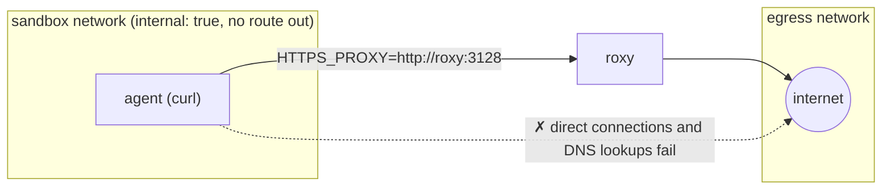
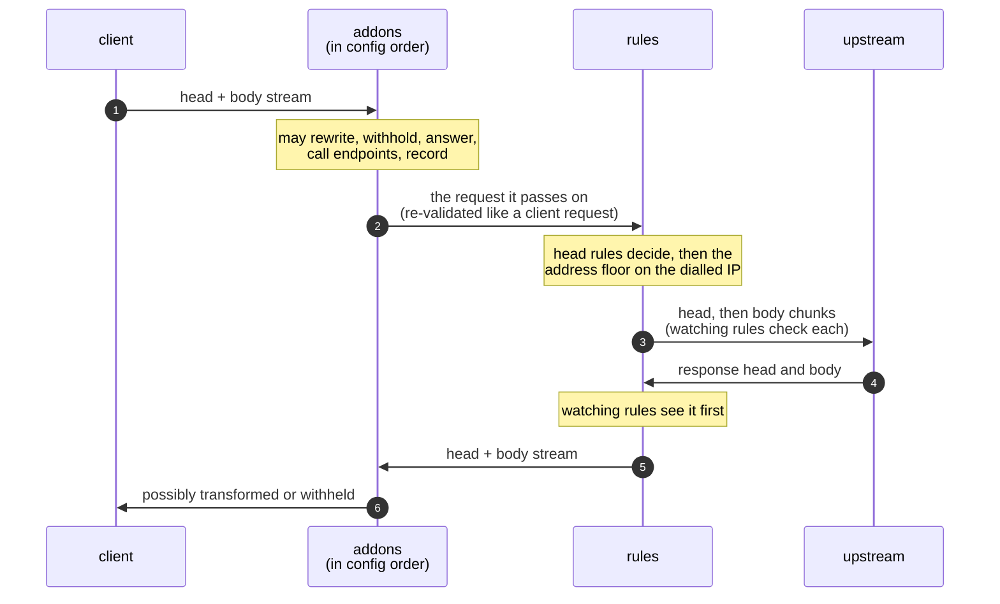

# roxy

roxy is a strict, programmable HTTP firewall and egress proxy. Clients use
it as an explicit `HTTP_PROXY`. It terminates TLS with leaf certificates
minted by its own CA, parses every request into a strict canonical model,
and re-serialises it in one unambiguous wire form, so smuggling and
header-injection tricks never reach the upstream. Every exchange then runs
through a pipeline you control:

- **Rules:** a YAML policy with a small, statically typed rule language.
  Deny always wins, there is an explicit default, and rules can keep
  watching an exchange as its bodies stream. Stateful metrics give rate and
  byte budgets, address lists give deny lists, and secret injection means
  clients only ever hold placeholders.
- **Addons:** plugin layers above the rules that own both streams: WASM
  components run in-process, or external services the traffic streams
  through. They can rewrite, withhold, score, answer or block traffic,
  call out to other services, and keep state. Whatever they let through is
  still judged by the rules.
- **Audit:** a structured JSONL flow log with the rule or addon behind
  every decision, and optional capture of traffic to disk. Neither drops a
  record: when a log falls behind or its disk fails, backpressure holds
  traffic until it catches up, so every exchange is logged.

It fails closed. Anything it cannot parse, verify or classify is dropped,
the default denies anything no rule allows, and a failing input or addon
denies rather than allows. That makes it a good fit wherever outbound HTTP
needs a hard boundary: untrusted or semi-trusted workloads such as AI
agents, CI jobs, sandboxes and third-party code; an egress gateway for a
fleet; or a place to plug in inspection, redaction and policy without
touching the clients.

## Quickstart

[`examples/compose`](examples/compose) runs a client container (curl, the
`agent` service) whose only way to the internet is through roxy:



```sh
cd examples/compose
docker compose up -d --wait     # ghcr.io/roxy-proxy/roxy:edge; add --build to build this checkout
./demo.sh                       # what the client can and cannot do
docker compose logs roxy        # roxy's flow log: one JSON line per decision
docker compose down -v
```

`demo.sh` runs these from inside the client:

| from the client | result |
|---|---|
| `curl https://example.com/` | `200`: rule `example-reads` allows it |
| `curl https://www.wikipedia.org/` | `403` from roxy: no rule allows it (`_default`) |
| `curl https://example.com/admin/` | `403` from roxy: rule `no-admin-paths` denies it, whatever allows the host |
| a 2 MB `POST` to `postman-echo.com` | `413`: the watching rule `upload-cap` stops it mid-upload |
| `curl --noproxy '*' https://example.com/` | fails: the name does not even resolve |
| `curl --noproxy '*' https://1.1.1.1/` | fails: no route |

**Containment comes from the network, not from the proxy settings.** roxy
is an explicit proxy, not a transparent gateway. The client's
`HTTPS_PROXY` only tells well-behaved clients where roxy is. What contains
the client is that it sits only on an `internal: true` Docker network, which
has no route out and no outside DNS, and that roxy is the only container on
both that network and one with a route out. A client that ignores the proxy
variables, or a library that opens its own sockets, gets nowhere.

To contain something real, replace the `agent` service with your workload
(keeping `networks: [sandbox]` and its environment) and edit
[`roxy.yaml`](examples/compose/roxy.yaml). After editing the policy,
`docker compose kill -s HUP roxy` reloads it: a bad policy is rejected and
the running one stays (see `docker compose logs roxy`). Restart instead
(`docker compose restart roxy`) for listener, TLS or capture settings.
Outside Compose, the same recipe and the hardened container image are in
[deployment](https://roxy-proxy.github.io/roxy-proxy/deploy/overview).

## A policy

A policy is a list of allows plus denies that restrict them. Any matching
deny wins, then any matching allow, then the default (`deny` unless set
otherwise). Rule order only orders effects such as header changes.

```yaml
default: deny

metrics:
  - id: github_writes
    count: requests
    where: host under "api.github.com" and method in [POST, PUT, PATCH, DELETE]
    key: [client.ip]
    window: 1m

rules:
  - id: github-reads
    when: host under "github.com" and method in [GET, HEAD]
    then: allow

  - id: openai
    when: host == "api.openai.com" and path starts_with "/v1/" and method == POST
    then:
      - set_header: { authorization: "Bearer ${secret:openai}" }   # the client never sees the key
      - allow

  - id: no-writes-burst                    # restricts the allows above
    when: metric.github_writes >= 30
    then: { deny: { status: 429 } }

  - id: upload-cap                         # watches the body as it streams
    when: host == "api.openai.com" and body.bytes > 10mb
    then: { deny: { status: 413 } }
```

Most rules read the request head and are decided before anything is
forwarded. A rule that reads something that arrives later (`body.bytes` as
an upload streams, `response.status`, a byte budget) keeps watching the
exchange and stops it the moment it matches. Try a policy without sending
traffic:

```sh
roxy rule test --config roxy.yaml POST https://api.github.com/repos/a/b/issues
```

The full language is in the [rule language reference](https://roxy-proxy.github.io/roxy-proxy/reference/rule-language).

## Extending roxy

roxy knows HTTP, not any particular application or API. Logic that needs to
understand the traffic goes in an **addon**: a plugin layer that sits
above the rules in every exchange and owns both streams. An addon can
rewrite, withhold or replace bodies chunk by chunk as they stream; deny or
answer directly; call named endpoints (a classifier, a model, an internal
API) with credentials roxy attaches and the addon never sees; and keep
state and record audit events.



Addons cannot weaken the boundary: whatever an addon sends on is
re-validated and judged by the rules as if the client had sent it, every
addon runs under budgets, and any failure denies the flow.

- **WASM components** run in-process and sandboxed, with no filesystem,
  sockets or environment. Write them in Rust with the
  [`roxy-addon`](crates/roxy-addon) SDK, or in any language that targets
  the WebAssembly component model, against [`wit/addon.wit`](wit/addon.wit).
- **Service layers** put an external service in the network path: each
  exchange streams through it over a WebSocket, request and response, and
  it can change, hold back, answer or refuse either. For logic in any
  language that is easier to run out of process, such as an
  [inspect_sentinel](https://github.com/meridianlabs-ai/inspect_sentinel)
  sidecar supervising an AI agent at the boundary.

See [addons](https://roxy-proxy.github.io/roxy-proxy/addons/overview) and [`examples/addons`](examples/addons).

## Documentation

The documentation site is at
[roxy-proxy.github.io/roxy-proxy](https://roxy-proxy.github.io/roxy-proxy/). Its source is in [`docs/`](docs).

- [Quickstart](https://roxy-proxy.github.io/roxy-proxy/quickstart) and [use cases](https://roxy-proxy.github.io/roxy-proxy/use-cases/ai-agents)
- [Principles and threat model](https://roxy-proxy.github.io/roxy-proxy/principles)
- [Configure policies](https://roxy-proxy.github.io/roxy-proxy/policies/overview): evaluation, secrets, rate
  limits, body rules, the address floor, WebSockets, testing
- [Addons](https://roxy-proxy.github.io/roxy-proxy/addons/overview): the layer stack, service layers, writing
  addons
- [Deploy](https://roxy-proxy.github.io/roxy-proxy/deploy/overview) and [operate](https://roxy-proxy.github.io/roxy-proxy/operate/operations):
  containing a workload, the container image, the CA, the flow log
- [Reference](https://roxy-proxy.github.io/roxy-proxy/reference/configuration): configuration, the rule
  language, HTTP, upstream, TLS, limits, architecture, development

Outstanding work is tracked in
[issues](https://github.com/roxy-proxy/roxy-proxy/issues).

## License

Licensed under either of [Apache License, Version 2.0](LICENSE-APACHE) or
[MIT license](LICENSE-MIT) at your option.
