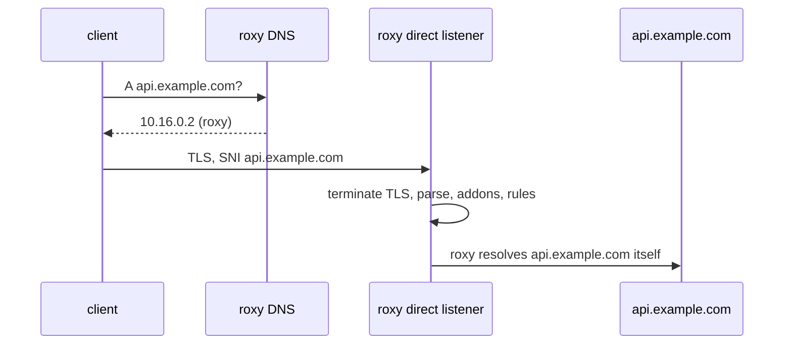

# DNS steering

How roxy reaches clients that have no proxy settings. roxy runs a DNS
listener that answers every name with its own address, so the client
connects to roxy as if roxy were the origin. A [direct
listener](http.md#direct-listeners) then takes the target from the TLS SNI
or the `Host` header, and the exchange goes through the same core as any
other: addons, rules, the address floor and the flow log.



The client needs only to trust roxy's CA ([CA distribution](tls.md#ca-distribution)).
This suits workloads that ignore `HTTPS_PROXY`: libraries that open their
own sockets, tools without proxy support, runtimes with their own HTTP
stacks.

```yaml
listeners:
  - { name: https, mode: direct, bind: 0.0.0.0:443 }
  - { name: http,  mode: direct, bind: 0.0.0.0:80 }

dns:
  bind: 0.0.0.0:53         # UDP and TCP
  answer:
    ipv4: 10.16.0.2        # roxy's address as the clients reach it
    ipv6: fd00:16::2       # optional
  ttl: 60s                 # default 60s
  records:                 # fixed answers, checked first
    db.sandbox.internal: [10.16.0.9]

log:
  flow:
    dns_events: true       # a dns_query event per answer; default false
```

## Answers

- **`A`** gets `answer.ipv4`; **`AAAA`** gets `answer.ipv6`. Without the
  address of that family, the answer is empty (NOERROR with no records,
  NODATA), and the client uses the other family.
- **A name in `records`** gets its fixed addresses instead, split by family
  the same way. Use it for a service on the sandbox network that clients
  should reach directly. At most 8 addresses per name.
- **Every other type** gets NODATA. That includes `HTTPS` and `SVCB`, whose
  records carry ECH configurations and alternative endpoints that would
  take a client around roxy's view of the name.
- Every answer has the TTL `ttl`.

roxy never forwards a query to another resolver. A forwarding resolver
would be a channel out of the sandbox (DNS tunnelling), and the client's
lookups never need one: roxy resolves the real addresses itself, with its
own resolver ([upstream DNS](upstream.md#dns)), when it connects. That
resolver must not be roxy's own DNS listener, or every name would resolve
to roxy.

## The wire format

The listener reads a deliberately small part of DNS, strictly
(`roxy-dns`, fuzzed as `dns_query`):

- A query with opcode QUERY and exactly one question of class IN. The name
  is uncompressed and made of letters, digits, `-` and `_`. Names are
  matched case-insensitively, and the question is echoed as sent.
- No answer or authority records. At most one additional record, which
  must be an EDNS OPT record; it is accepted and ignored.
- Nothing after the last record.

| query | reply |
|---|---|
| shorter than a header, longer than 4096 bytes, or a response (`QR` set) | none: dropped |
| an opcode other than QUERY | NOTIMP |
| malformed: counts, compression, a cut or overlong name, trailing bytes | FORMERR |
| a class other than IN, the root name, a byte outside the name alphabet | REFUSED |
| anything else | NOERROR, with the answers above |

Every reply fits in 512 bytes, so nothing is ever truncated, and UDP and TCP
answer the same way. Over TCP (RFC 7766), queries are length-prefixed and a
connection carries any number of them. It closes after
`limits.idle_timeout` of silence, on a query longer than 4096 bytes, or on a
message that is dropped. TCP connections count against the [connection
caps](limits.md#connections); UDP has no per-client state.

## What it does not contain

DNS steering is a convenience, not containment. A client can still use a
hard-coded address or its own resolver. As with the explicit proxy, the
network is what contains a workload: it must have no route out except
through roxy ([Deployment](deployment.md#dns-steering)).

`dns` settings need a restart: a reload that changes them logs a warning,
and the running listener keeps its settings ([reload](rules.md#reload)).
